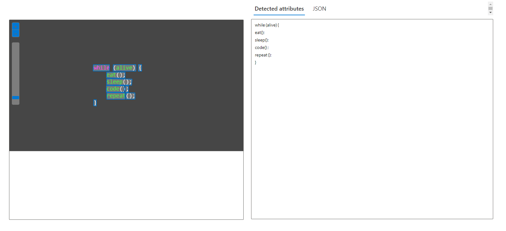

# Projeto de reconhecimento textual no Azure ML

Neste repositório encontra-se um tutorial de como reproduzir meu primeiro projeto de reconhecimento textual no Microsoft Azure ML. O objetivo do projeto é familiarizar o usuário com a plataforma e a ferramenta.

## Tutorial para recriar o projeto

1. Crie um recurso **Azure AI services**, com o nome de sua escolha, e aguarde seu deploy.

2. Acesse o [Vision Studio](https://portal.vision.cognitive.azure.com).

3. Selecione o recurso criado, em **meus recursos**.

4. Defina o recurso como padrão.

5. Feche a aba e acesse a guia **Face** na galeria. Acesse **extrair texto de imagens**.

6. Nesta aba, você poderá enviar fotos de sua escolha (ou utilizar as sugeridas). Ao enviar uma imagem, em **atributos detectados** teremos o texto extraído da imagem.

> Exemplo: 

